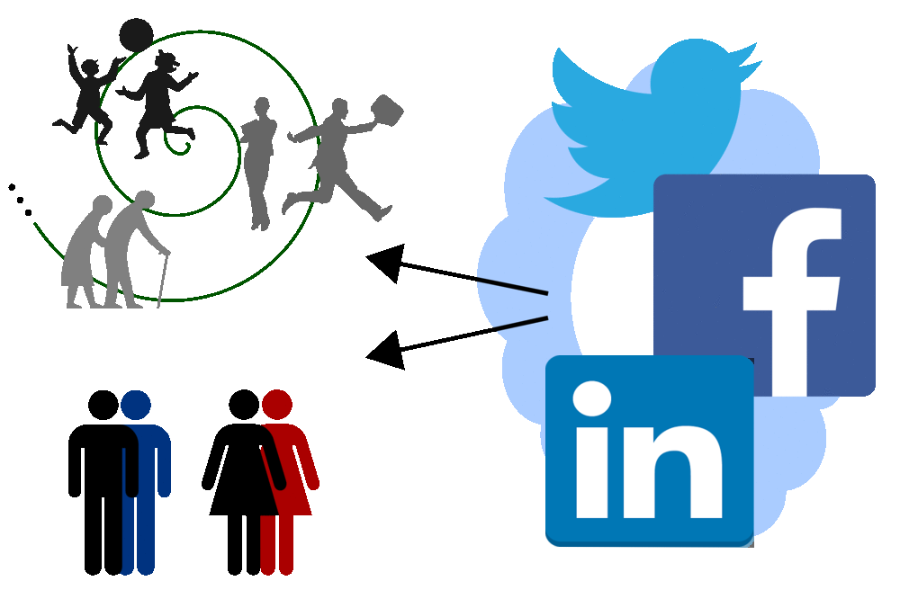

# Gender and Age Classification using Facial Features

### *Note: More images your provide, more accurate it can achieve.

Automatic age and gender classification has become relevant to an increasing amount of applications, particularly since the rise of social platforms and social media. Nevertheless, performance of existing methods on real-world images is still significantly lacking, especially when compared to the tremendous leaps in performance recently reported for the related task of face recognition. In this project we show that by learning representations through the use of deep-convolutional neural networks (CNN), a significant increase in performance can be obtained on these tasks compare to other models. Age and gender classification is an inherently challenging problem though, more so than many other tasks in computer vision. The main reason for this discrepancy in difficulty lies in the nature of the data that is needed to train these types of systems. While general object classification tasks can often have access to hundreds of thousands, or even millions, of images for training, datasets with age and/or gender labels are considerably smaller in size, typically numbering in the thousands or, at best, tens of thousands. The reason for this is that in order to have labels for such images we need access to the personal information of the subjects in the images. Namely we would need their date of birth and gender, and particularly the date of birth is a rarely released piece of information.

## Problem

Classifying age and gender from facial features using Convolution Neural Networks. 

## Research questions

1. How to extract the useful features from an image.  
2. How to enhance the classifier accuracy to predict the correct results. 
3. What features would help in identifying the gender and age of a person. 

## Related work

1. [Age and Gender Estimation of Unfiltered Faces](https://pdfs.semanticscholar.org/1be4/98d4bbc30c3bfd0029114c784bc2114d67c0.pdf)
2. [Age and Gender Classification using Convolutional Neural Networks](http://www.openu.ac.il/home/hassner/projects/cnn_agegender/CNN_AgeGenderEstimation.pdf)

## Data

I am collecting LinkedIn profiles one by one based on profile id. i.e [williamhgates](https://www.linkedin.com/in/williamhgates). 

The collection spans over the period June 2016 - November 2016. I have collected around 8000 profiles and out of which around 3000 profiles have all information which are useful for my project. 

Here is the sample metadata: [williamhgates](https://github.com/tapilab/is-hparik11/blob/master/src/Profile_Source/williamhgates.txt). 

After getting data in XML format, I am converting into readable JSON format and keeping only useful information out of it. 
for i.e 

{
'Full_Name': 'Eryn Olson',
'Gender': 'Female',
'Profile_Url': 'https://media.licdn.com/mpr/mpr/shrinknp_400_400/AAEAAQAAAAAAAAbyAAAAJDMzZjQ4NjViLTIwZTctNDM0Yi05ODI5LTk0NmYzZWZmZDI5Yg.jpg',
 'Recommended_Ids': ['erynolson',
  'eryn-olson-62639510a',
  'eryn-olson-432679b1',
  'eryn-olson-1351aa74',
  'courtney-tillman-8b62a664',
  'chance-cozby-13235224',
  'bill-gates-b1a606b0',
  'sarah-eves-2937a719',
  'andrew-solheim-810a3517',
  'andrea-cundiff-76020535',
  'mollie-harper-6b850947',
  'tyler-shaw-934b7',
  'donna-conroy-66987340',
  'paul-wood-73455920'],
 'User_ID': 'eryn-olson-50328143',
 'age': 20
 }

## Methods

1. Collected LinkedIn profiles data and parse useful information from it. This will be an ongoing process to extract as much as possble data.
2. Extract the faceial features from an image and store it category wise. 
3. Labelized processed data. i.e for Gender recognition, Male & Female and for Age recogintion, Youth & Senior. 
4. Trained the classifier with basic classification method to check the validity of data. 
5. Again trained the classifier with deep learning models i.e CNN and observed the accuracy of classifier. 

## Results

Here is a summary of the main results.

## Conclusions / Future Work

1. Keep collecting more data to get better accuracy. 
2. Try to diminish testing error and remove noise from data. 
